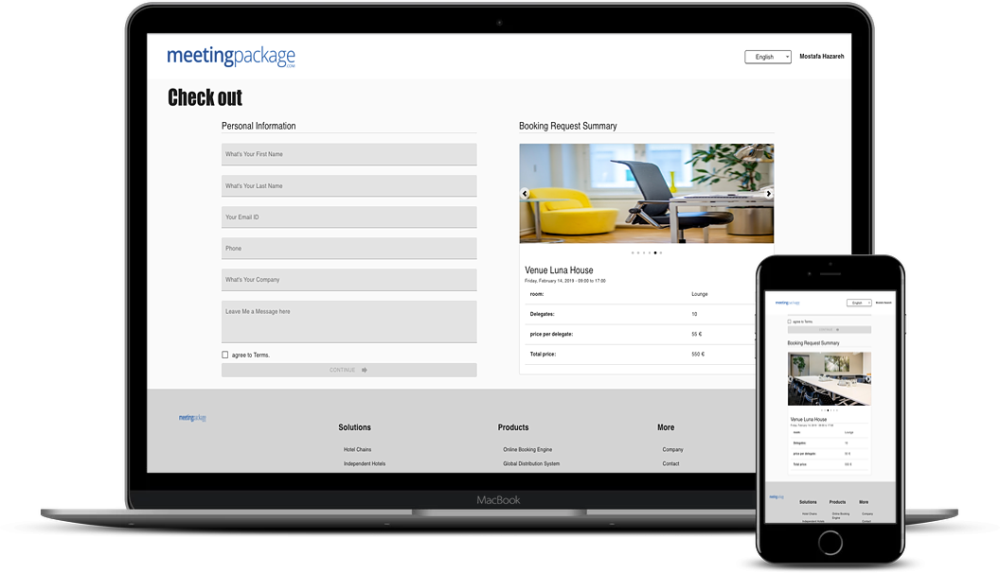

# MeetingPackage assignment

I have done this assignment for Internship position with using React JS.

## Preview

## Technologies are used in this assignment App:
 - JavaScript
 - ReactJS
 - Material-ui

 ## INSTALL 
    $ git clone https://github.com/MostafaIn/wolt-summer2020.git
    $ cd wolt-assignment
    $ npm install

## Start & watch

    $ npm start  OR yarn start

### Done By
- Mostafa Hazareh (http://mostafaportfolio.netlify.com)